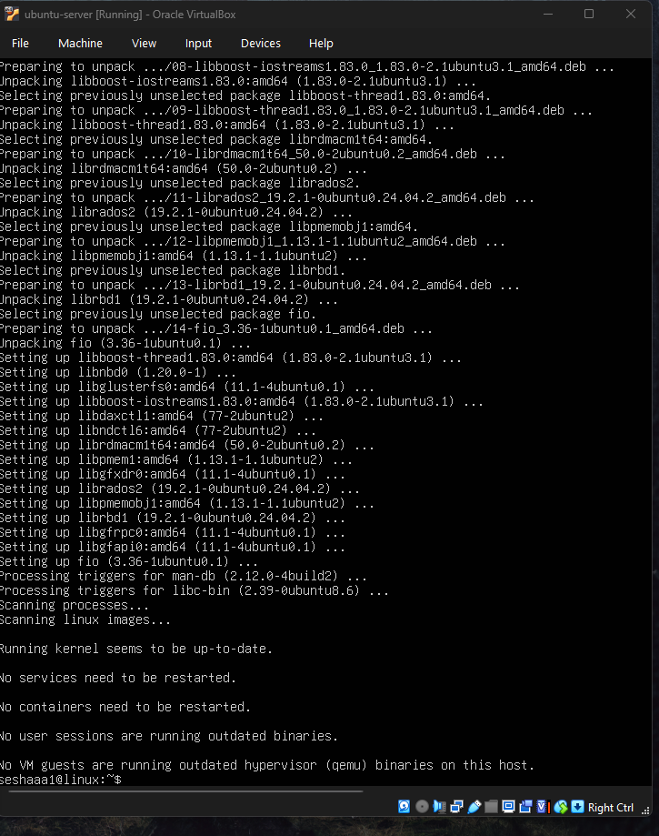

## Week 3 – Application Selection for Performance Testing
Application Selection Matrix

This week I focused on choosing the tools I’ll use later for performance testing.
The goal was to cover different types of workloads the operating system might deal with — CPU, memory, disk, network and a simple server application.

I picked tools that are lightweight, easy to install on Ubuntu Server, and commonly used in real system testing.

Workload Type	Application	Why I Chose It
CPU-Intensive	stress-ng	Can push the CPU to 100% and supports very specific stress tests.
RAM-Intensive	stress-ng (memory mode)	Lets me allocate large chunks of memory and see how the system behaves under pressure.
Disk I/O-Intensive	fio	A standard benchmarking tool for testing read/write speeds and latency.
Network-Intensive	iperf3	Makes it easy to test network throughput between the workstation and server.
Server Application	nginx	Lightweight web server that behaves predictably and is perfect for simple load testing.
Installation Documentation (All via SSH)

All installations were (or will be) done from the workstation using SSH, not inside the VM directly.

Before installing anything, I update the package list:

ssh alex@192.168.56.20 "sudo apt update"

Below are the installation commands for each tool:

**Update and upgrade system**

sudo apt update && sudo apt upgrade -y

**CPU and RAM stress tool**

sudo apt install stress-ng -y

**Disk I/O benchmarking tool**

sudo apt install fio -y

**Network performance tool**

sudo apt install iperf3 -y

**Simple web server**

sudo apt install nginx -y
sudo systemctl enable nginx
sudo systemctl start nginx

Screenshots of these installs will be included later during the practical weeks.

Expected Resource Profiles

Before running any tests, I wrote down how I expect each tool to behave.
This will help me compare real performance data in Week 6.

CPU-Intensive – stress-ng

CPU usage should spike close to 100% on each core.

Very little RAM or disk use.

Good for checking process scheduling and load average.

RAM-Intensive – stress-ng (memory mode)

High RAM usage depending on the size I allocate.

Possible swap usage if memory runs out.

Lower CPU usage compared to the CPU test.

Disk I/O – fio

Heavy read/write operations.

Increase in IOPS and disk latency.

Moderate CPU usage due to I/O handling.

Network – iperf3

High throughput tests between workstation ↔ server.

Minimal RAM and CPU usage.

Great for testing bandwidth and latency.

Server Application – nginx

Very low resource usage when idle.

Under load, small CPU and RAM increase.

Useful for checking response times and connection handling.

Monitoring Strategy

Each application needs a specific way of monitoring its impact on the system.
All tests will be monitored remotely over SSH.

CPU Testing (stress-ng)

I’ll monitor CPU behaviour with:

ssh alex@192.168.56.20 "top -b -n 1"
ssh alex@192.168.56.20 'vmstat 2 5'

Metrics:

CPU %

Load average

Context switching

RAM Testing (stress-ng in memory mode)

Monitoring commands:

ssh alex@192.168.56.20 "free -h"
ssh alex@192.168.56.20 'vmstat 2 5'

Metrics:

RAM usage

Swap usage

Memory pressure

Disk Testing (fio)

Monitoring commands:

ssh alex@192.168.56.20 "iostat -x 2 5"
ssh alex@192.168.56.20 'vmstat 2 5'

Metrics:

IOPS

Read/write speed

Disk latency

Disk utilisation %

Network Testing (iperf3)

Server side (VM):

iperf3 -s

Workstation side:

iperf3 -c 192.168.56.20

Metrics:

Network throughput

Jitter

Packet loss

Nginx Web Server Testing

Monitoring commands:

ssh alex@192.168.56.20 "ss -tuna"
ssh alex@192.168.56.20 'top -b -n 1'

External test:

curl -I http://192.168.56.20

Metrics:

Response time

Active connections

Basic request handling performance

Week 3 Reflection

This week helped me decide which tools I’ll rely on later for testing the system under different workloads.
Choosing real Linux testing tools made me understand how performance testing is normally done in server environments.

I now have a clear plan for:

What I will test

How I will stress each part of the system

How I will collect performance data

Which commands I will use during monitoring

This sets me up well for Week 4, where I’ll begin locking down the server and applying the first security configurations.

**Week 3 Deliverables Checklist:**

Application Selection Matrix Included above - completed

Installation Documentation	Commands listed - completed

Expected Resource Profiles	Section above - completed

Monitoring Strategy	Covered for each tool - completed

Reflection	End of Week 3 - completed

