## Week 5 – Advanced Security and Monitoring Infrastructure
Access Control with AppArmor

Ubuntu Server uses AppArmor by default, so this week I strengthened access control and documented how to track its behaviour.

Checking AppArmor status
ssh alex@192.168.56.20 "sudo aa-status"

This shows which profiles are:

enforced

complain

unconfined

Monitoring AppArmor events

To track denied actions:

ssh alex@192.168.56.20 "sudo journalctl -k | grep DENIED"

Applying profiles

Most essential services already have default enforced profiles, including nginx.
These profiles help prevent applications from accessing files or paths outside their permission scope.

Automatic Security Updates

Security updates ensure the system receives patches without manual intervention.

Installing automatic updates
ssh alex@192.168.56.20 "sudo apt install unattended-upgrades -y"

Enabling the service
ssh alex@192.168.56.20 "sudo dpkg-reconfigure --priority=low unattended-upgrades"

Checking logs
ssh alex@192.168.56.20 "sudo tail /var/log/unattended-upgrades/unattended-upgrades.log"

fail2ban Intrusion Detection

fail2ban helps block repeated failed login attempts, especially for SSH.

Installing fail2ban
ssh alex@192.168.56.20 "sudo apt install fail2ban -y"

Enabling the service
ssh alex@192.168.56.20 "sudo systemctl enable fail2ban --now"

Checking fail2ban status
ssh alex@192.168.56.20 "sudo fail2ban-client status"

Security Baseline Verification Script (security-baseline.sh)

This script runs on the server, verifying all security controls from Week 4 and 5.

#!/bin/bash

**Security Baseline Verification Script**

echo "Checking SSH configuration..."
grep -E "PasswordAuthentication no" /etc/ssh/sshd_config
grep -E "PermitRootLogin no" /etc/ssh/sshd_config

echo "Checking firewall rules..."
sudo ufw status verbose

echo "Checking AppArmor status..."
sudo aa-status

echo "Checking fail2ban status..."
sudo fail2ban-client status

echo "Checking automatic updates..."
grep "Unattended-Upgrade" /etc/apt/apt.conf.d/20auto-upgrades

Remote Monitoring Script (monitor-server.sh)

This script runs on the workstation, collecting performance data from the server over SSH.

#!/bin/bash

**Remote Server Monitoring Script**

SERVER="192.168.56.20"

echo "Collecting CPU stats..."
ssh alex@$SERVER "top -b -n 1"

echo "Collecting memory stats..."
ssh alex@$SERVER "free -h"

echo "Collecting disk I/O stats..."
ssh alex@$SERVER "iostat -x 2 5"

echo "Collecting network stats..."
ssh alex@$SERVER "ss -tuna"

Week 5 Reflection

This week deepened my understanding of Linux security controls beyond the basics.
I configured AppArmor profiles, enabled automatic updates, and installed fail2ban to guard against brute-force attacks.
Creating both scripts helped me practice automation and prepare for the monitoring workflows required in Week 6.

**Week 5 Checklist:**

Access Control (AppArmor)	Section above- completed

Automatic Updates	Enabled + log checks- completed

fail2ban Configuration Service enabled- completed

security-baseline.sh	Script included - completed

monitor-server.sh	Script included- completed

Reflection	Completed- completed

**VM commands:**
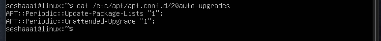
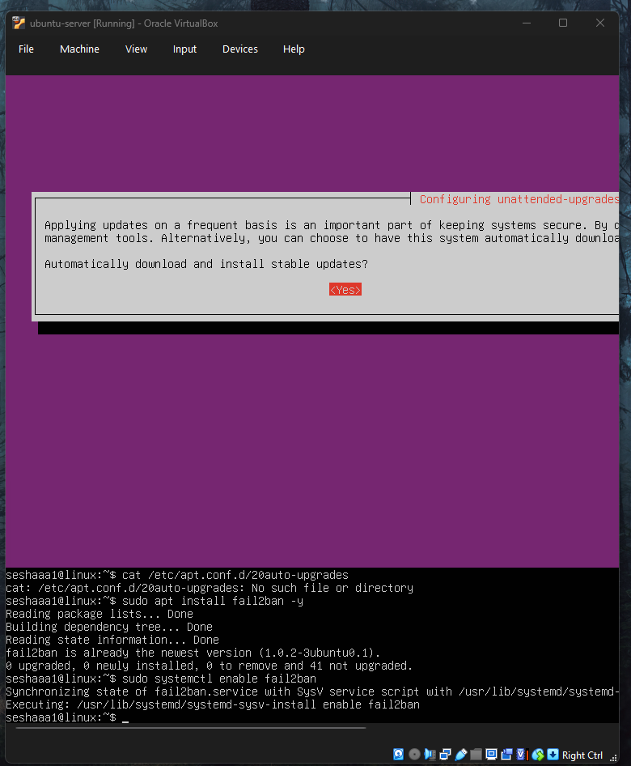
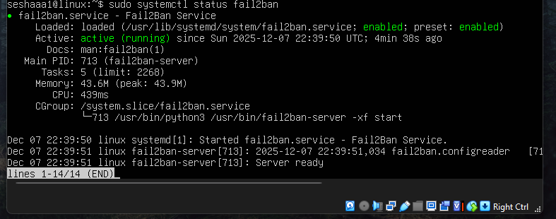
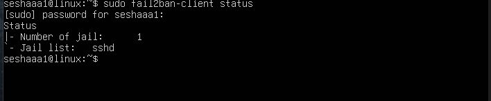
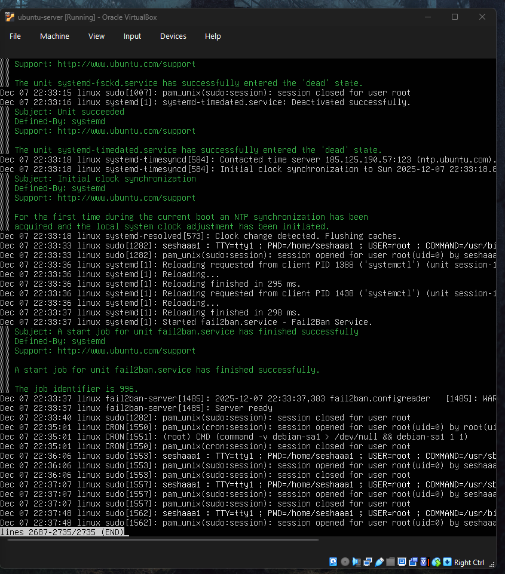
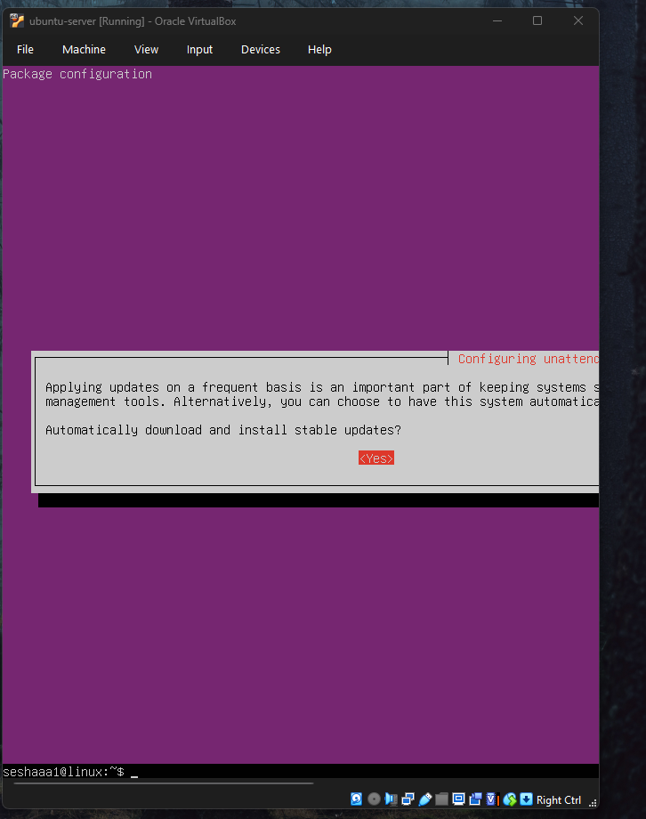
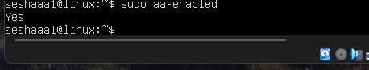
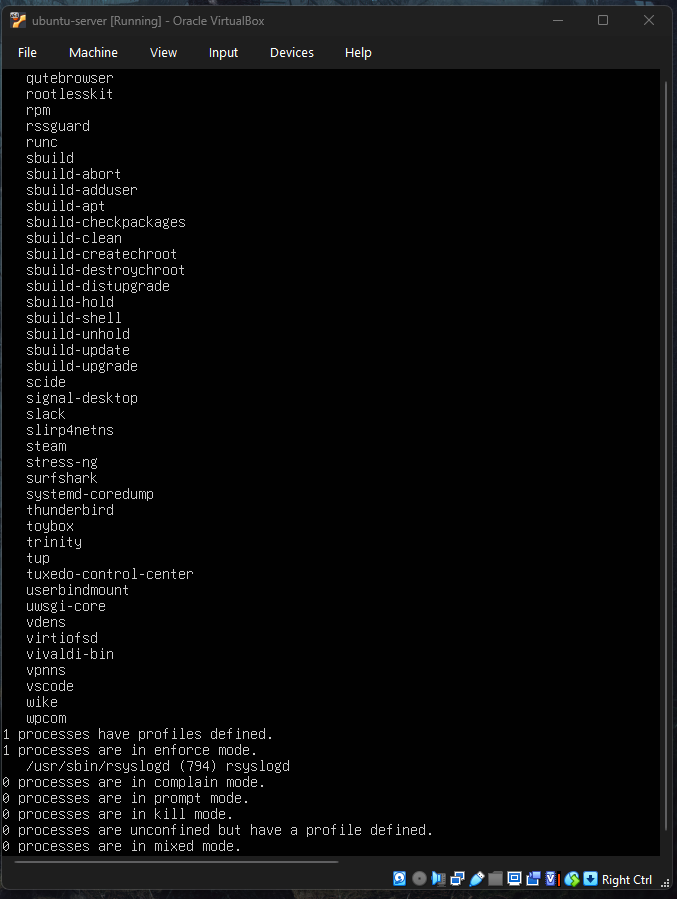
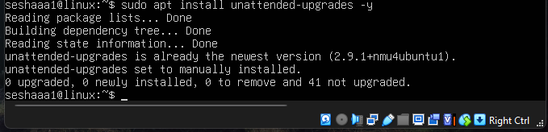
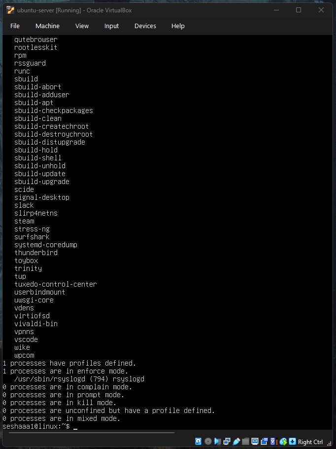
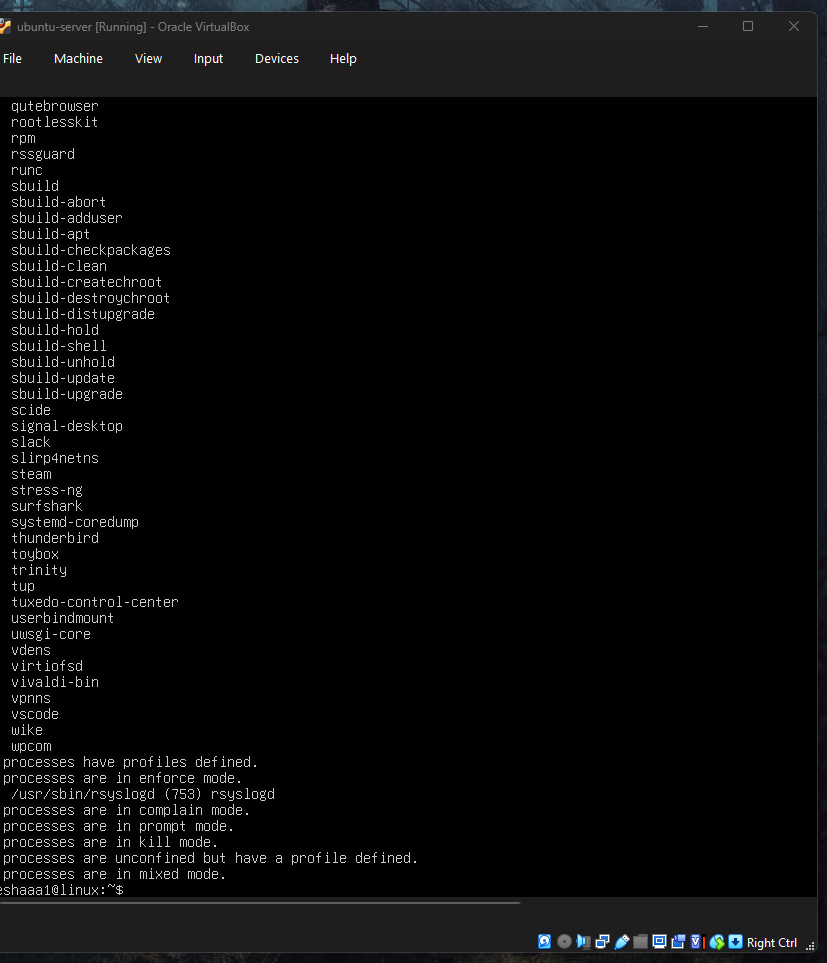
