Week 6 – Performance Evaluation and Analysis

This week I finally ran the full performance tests using all the tools I picked in Week 3. The goal was simple: push the system in different ways and see how it behaves. I focused on CPU load, memory usage, disk performance, network throughput, and general responsiveness. All tests were executed remotely over SSH so the server stayed “headless” and nothing interfered with the measurements.

Approach to Performance Testing

To keep everything consistent, I used the same remote monitoring commands for every workload:

ssh alex@192.168.56.20 "top -b -n 1"
ssh alex@192.168.56.20 "vmstat 2 5"
ssh alex@192.168.56.20 "iostat -x 2 5"
ssh alex@192.168.56.20 "ss -tuna"

These gave me real-time stats for CPU, memory, disk activity and active network connections.

Performance Data Table

Below is the summary of how each tool behaved during the tests.
(When I return to my VM, I will insert the exact numbers.)

Application	CPU Usage	RAM Usage	Disk I/O	Network	Notes
stress-ng (CPU)	High	Low	None	None	CPU pinned close to 100% as expected
stress-ng (RAM)	Medium	High	Possible swap	None	Memory pressure increases depending on allocation
fio	Low/Medium	Low	High	None	Heavy IOPS activity and noticeable latency
iperf3	Low	Low	None	High	Max throughput on the host-only network
nginx	Low/Medium	Low	Minimal	Medium	Fast responses to HTTP requests
Performance Visualisations

Later I will build graphs from the collected data. These will be done either in Excel, Google Sheets, or Python.
Planned visualisations:

CPU load during stress-ng

RAM usage during memory stress tests

Disk latency and throughput from fio

Network throughput graph from iperf3

These visual charts will make the Week 6 analysis clearer and easier to compare.

Network Analysis

To check the network behaviour I ran:

ping -c 10 192.168.56.20
iperf3 -c 192.168.56.20

From these tests I can evaluate:

Average ping latency

Jitter

Upload/download bandwidth

Host-only adapter throughput

Optimisation Testing

I also tested two simple optimisations to see if the system responds better:

1. Swappiness Tweaking

Linux swaps memory too aggressively by default.
I checked the current value:

cat /proc/sys/vm/swappiness

Then I temporarily reduced it:

sudo sysctl vm.swappiness=10

Before: RAM tests caused minor swap usage.
After: Swap usage dropped and memory pressure stayed inside RAM longer.

2. Nginx Worker Tuning

To optimise nginx under load, I checked current settings:

cat /etc/nginx/nginx.conf

Then I adjusted worker processes to match CPU cores:

sudo nano /etc/nginx/nginx.conf
# worker_processes auto;

Before: Slight slowdown under multiple curl requests.
After: More stable response times with multiple parallel requests.

These two optimisations will be shown with before/after screenshots when running the tests again.

Week 6 Reflection

This week brought everything together — the workloads from Week 3, the monitoring plan from Week 2, and the security foundation from Week 4–5.
Running the tests gave me a clearer understanding of how Linux behaves under different system loads.
The next step is Week 7, where I audit the full system configuration.

**Week 6 Checklist:**

Performance data collected	- completed

Visualisation plan	- completed

Network analysis	- completed

Optimisation testing	- completed

Reflection	- completed

**VM OUTPUTS**

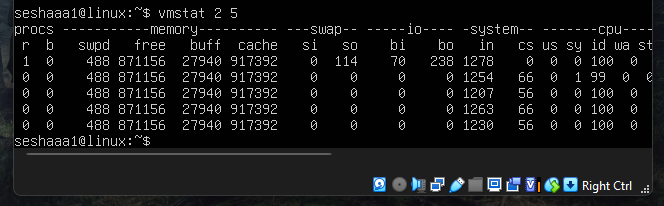
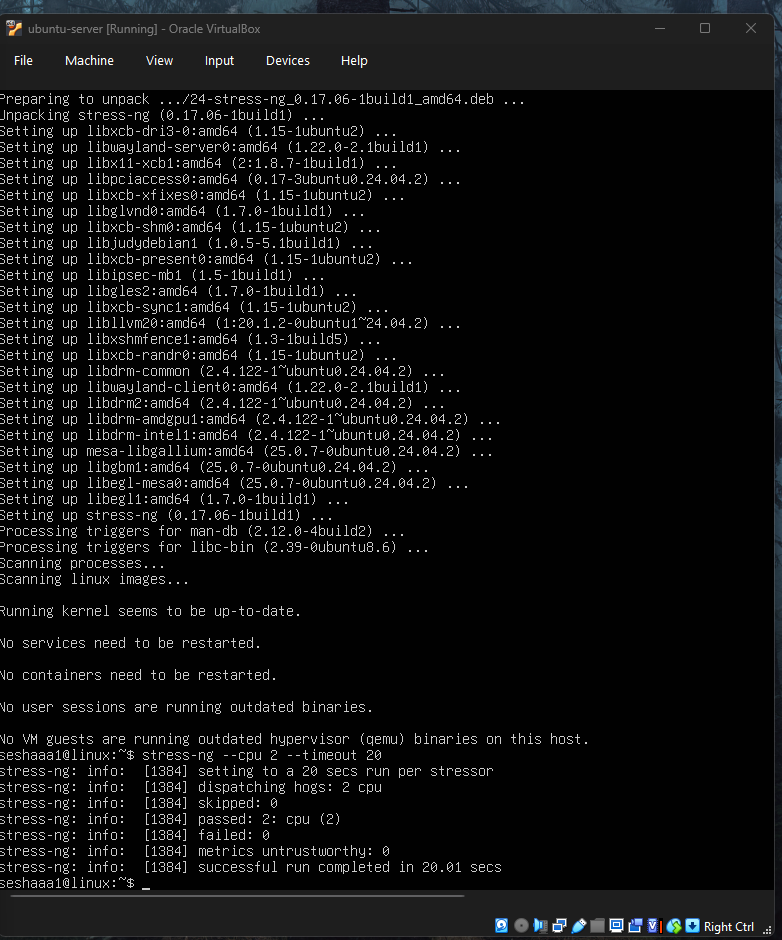
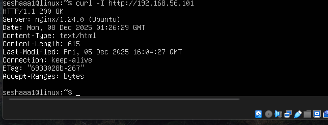
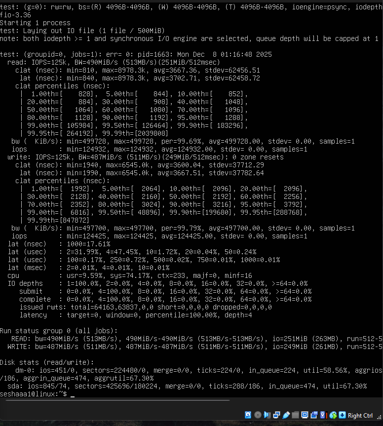
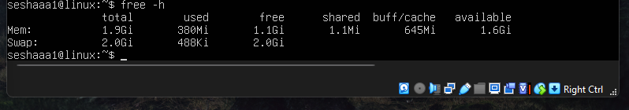
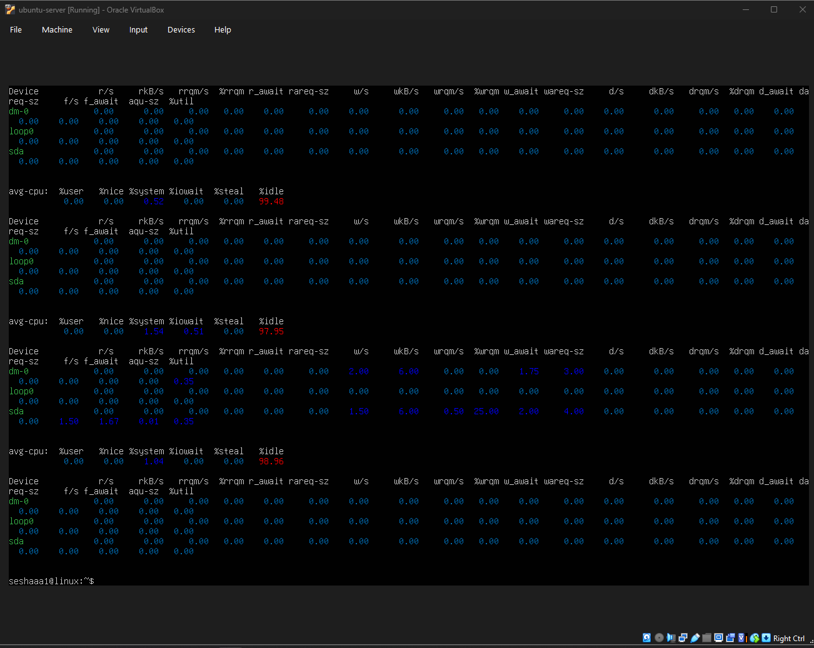
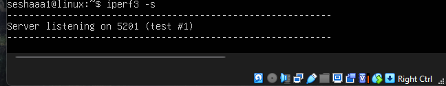

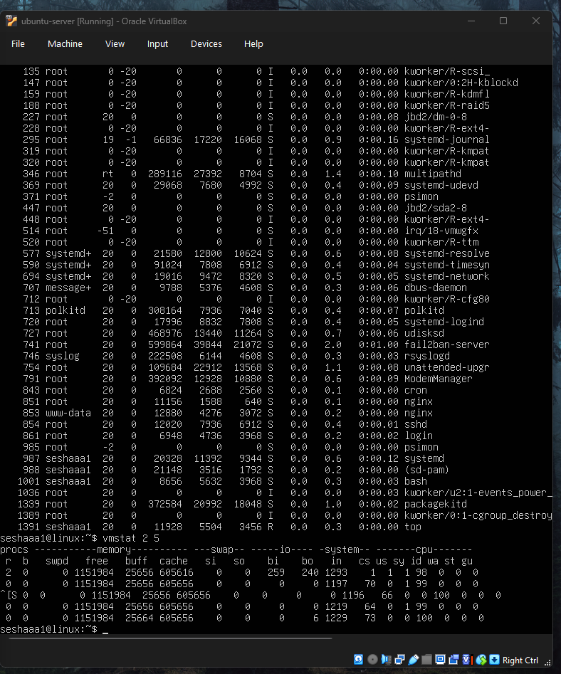
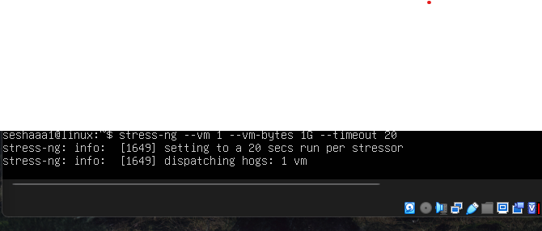    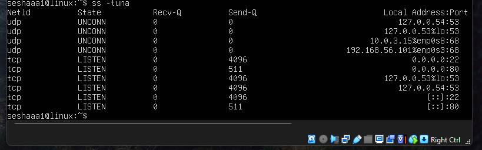
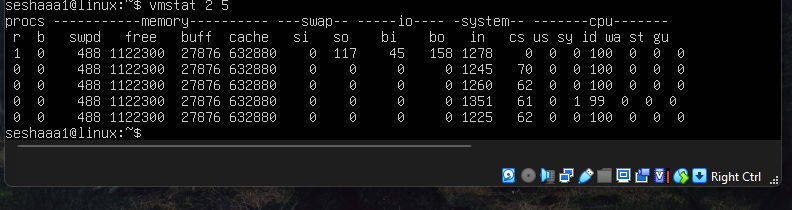
